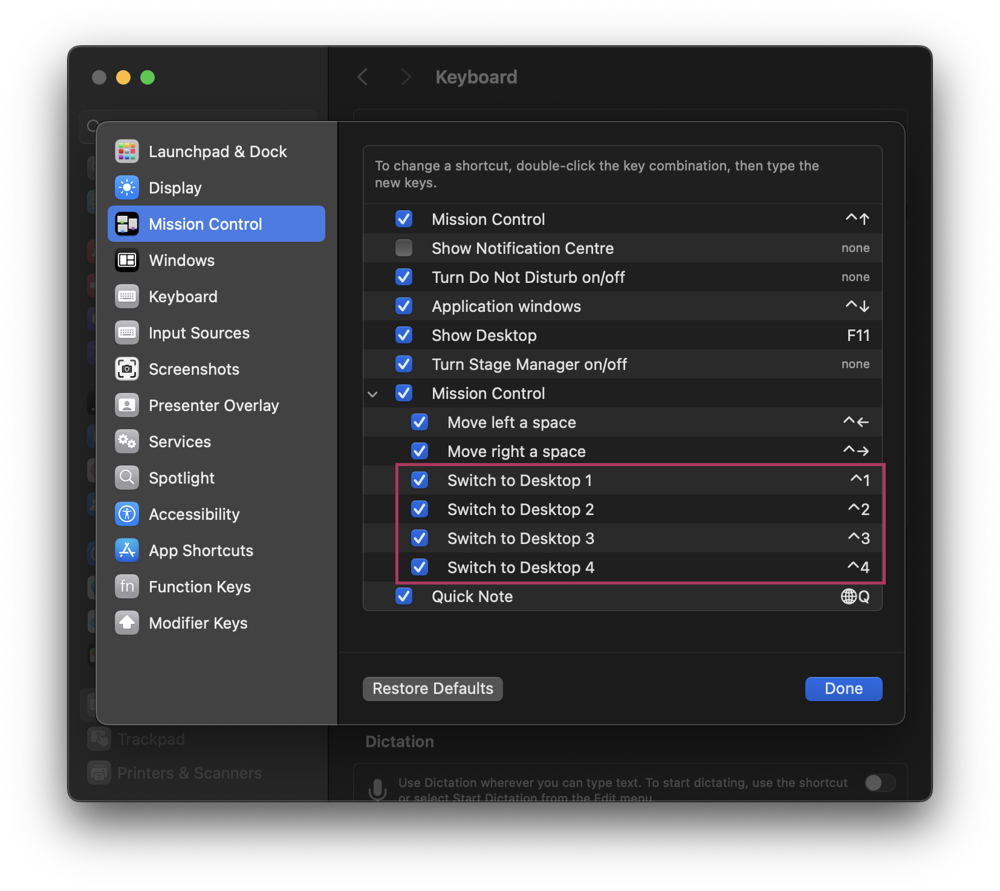
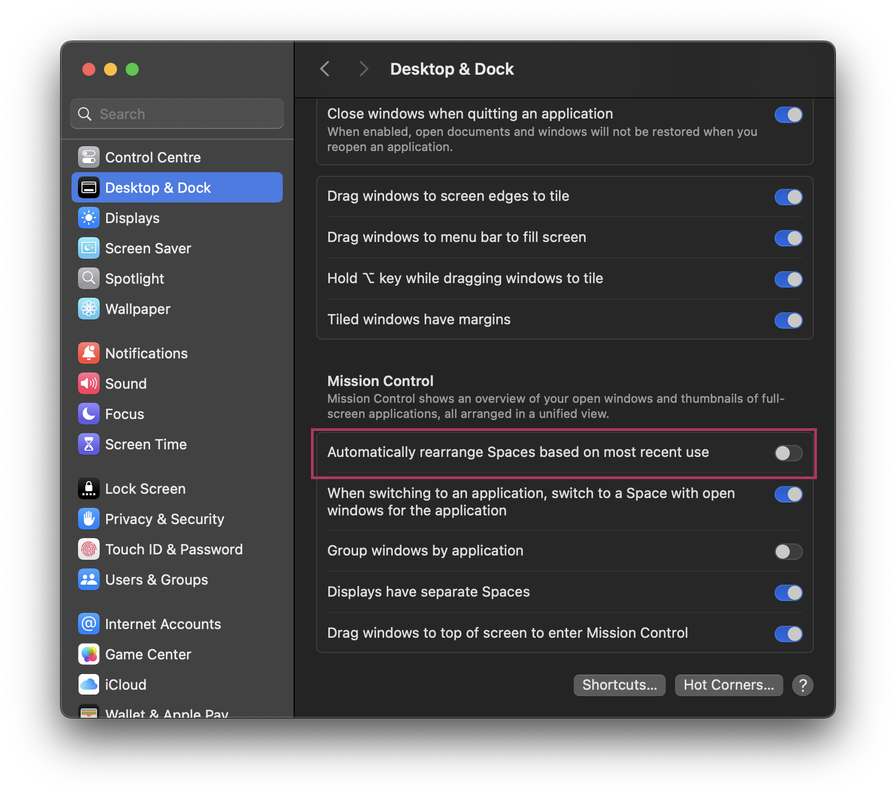

## Intro

Most tiling window managers provide a first-class experience when working keyboard-only. Common examples are [Hyprland for Linux](https://github.com/hyprwm/Hyprland) and [AeroSpace for macOS](https://github.com/nikitabobko/AeroSpace). Glide can provide the same workflow with a few tweaks to your system configuration.

:::note[Mac keyboard note]
Throughout this documentation, "Alt" refers to the Option (⌥) key on Mac keyboards. For example, "Alt+Z" means pressing Option+Z.
:::

## Hotkeys to switch macOS Spaces

macOS provides an option to configure hotkeys to switch to specific Spaces. They are hidden, though. To configure them:

1. Create several Spaces. As a rule of thumb, estimate your usual workflow, decide how many Spaces you need, and create them. They can be empty or contain any apps.
2. Go to `System Settings` -> `Keyboard` -> `Keyboard Shortcuts` -> `Mission Control`. In the `Mission Control` section, find `Switch to Desktop X`. Enable all checkboxes and, optionally, set your own hotkeys.



Now you can switch Spaces with the combination `^ + X` (`Control + X`), where `X` is the target Space number.

:::note
If you want add more Spaces with hotkeys, just follow the same steps - first create as many Spaces as you need, then go back to `Keyboard Shortcuts` and enable checkboxes
:::

## Preserve Space order

macOS rearranges your Spaces by default so the most recently used appears closer to the first (main) Space. This is counterintuitive if you arranged your Spaces in a specific order, like Space 1 for browser and mail, Space 2 for the terminal, Space 3 for the IDE, etc.

Luckily this can be disabled by unchecking `System Settings` -> `Desktop & Dock` -> `Automatically rearrange Spaces based on most recent use`.



When unchecked, macOS preserves the order of your Spaces. For example, you can place your browser in Space 1 and the terminal in Space 2, and that order will stay the same regardless of workflow.

## Glide neat options

By default Glide has to be activated on each Space individually. This can be changed:

```toml
[settings]

default_disable = false
```

You can enable space index to visualize your current Space. Note that this setting is experimental and might get changed or removed in the future.

```toml
[settings.experimental]

status_icon.space_index = true
```

## Understanding tree navigation (ascend/descend)

Glide organizes windows in a tree hierarchy. Understanding this hierarchy is key to advanced window management.

### What are ascend and descend?

The `ascend` and `descend` commands allow you to navigate up and down this tree hierarchy by changing your **selection**. Think of it like navigating directories in a file system - you can move up to parent nodes or down to child nodes.

**Important:** These commands change which node is *selected* (similar to `move_focus`), not the position of windows. The selected node affects what happens when you execute commands like `move_node`, `split`, or `group`.

### How it works

- **`ascend`** (default Alt+A): Selects the parent node of your current selection
- **`descend`** (default Alt+D): Selects a child node of your current selection

:::note
Currently, the selected node is not visually indicated (see [issue #100](https://github.com/glide-wm/glide/issues/100)). This can make it confusing to track where you are in the tree. Until this is implemented, you may need to experiment to understand the current selection.
:::

### Example use case

If you have created containers using the `split` command (default Alt+Backslash or Alt+Equal), you can use ascend/descend to navigate between the container and the windows within it. This allows you to:

1. Select a container to perform operations on the entire group
2. Move between different levels of nested containers
3. Reorganize complex window layouts

For more details on containers and the tree structure, see the section on splitting and grouping in the configuration reference.
